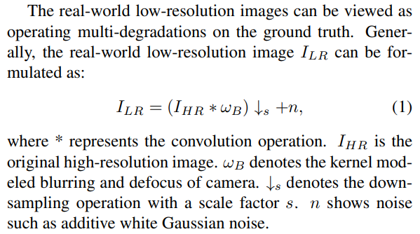

## Real Super Resolution

해당 challenge는 `real super resolution`이라고도 불리며,
기존의 super resolution이 디지털 영상의 해상도를 향상시키는데에 초점이 맞춰져 있었던 반면,
real super resolution에서는 DSLR 카메라를 통해 같은 물체에 대해 렌즈를 바꿔주면서 서로다른 초점거리로 촬영한다.
[Wikipedia의 초점거리](https://en.wikipedia.org/wiki/Focal_length) 항목을 보면 알 수 있듯이 초점거리가 더 길어질수록 더 먼 거리에 있는 사물을 고해상도로 촬영할 수 있으며, 초점거리가 짧을 수록 시야각이 더 넓어진다.
짧은 초점거리에서 촬영된 영상에서 긴 초점거리에서 촬영된 것과 같은 부분만을 잘라낸다면 고해상도(HR)와 저해상도(LR) 영상을 얻을 수 있다.
기존의 Super Resolution에서 다루던 영상의 interpolation기법을 통해 LR 영상을 만들던 방법에 비해서 

고해상도의 영상을 얻는 것은 딥러닝 이전부터도 많이 연구되어오던 분야이고, 
EDRN의 introduction 부분 읽어보면 좋을 듯

Deep learning based SISR
methods have developed explosively in recent years [5, 6,
14, 15, 41]. These methods are effective for the bicubic
degradation. However, the degradations for real-world low

## Real Super-Resolution

일반적인 Super-Resolution에서는 biqubic과 같은 디지털적인 방법으로 HR이미지로부터 LR이미지를 생성한다.
하지만 이 방법은 카메라 초점에 따른 문제, 노이즈 문제 등에 취약하고, 그렇기 때문제 기존의 Super-Resolution 기법을 실제 사진에 적용했을 때 좋지 않은 결과가 나타난 것이다.
